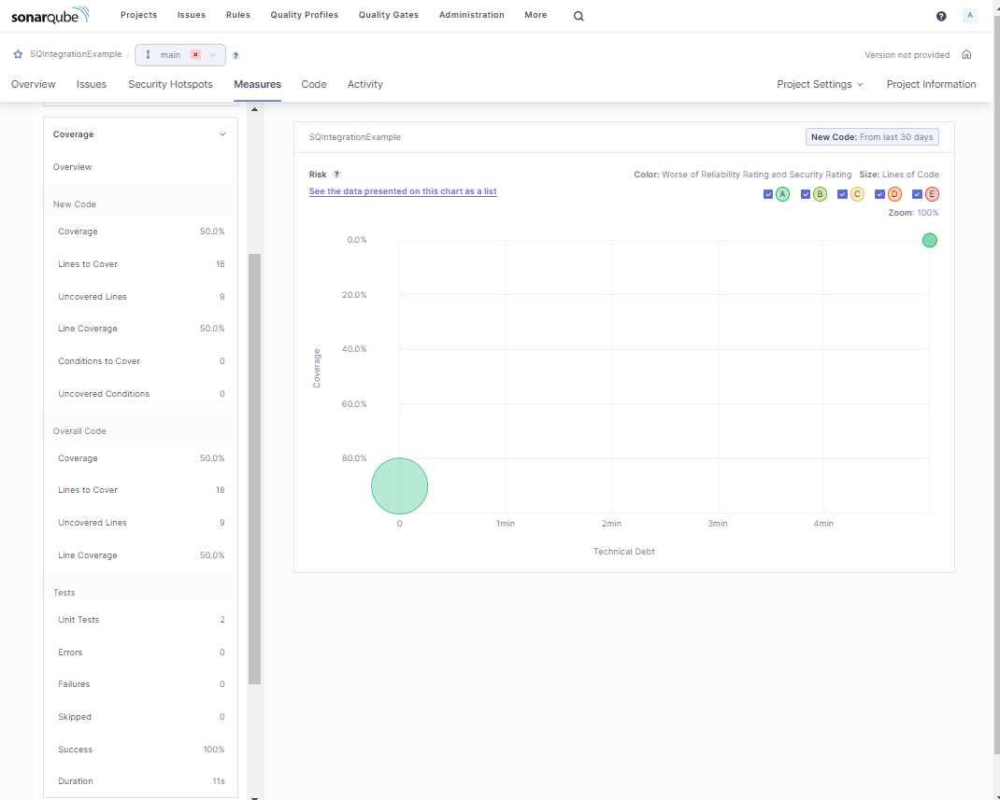

# SonarQube sonar-ps-plugin Integration
Extent sonar-ps-plugin Integration to analyze scripts using custom rules and show Test Cases and Code Coverage in SonarQube

# Inspired by PSScriptAnalyzer and Pester
- [ScriptAnalyzer](https://github.com/PowerShell/PSScriptAnalyzer)
- [Pester](https://pester.dev/docs/quick-start)
- [SonarQube](https://www.sonarsource.com/)
- [sonar-ps-plugin](https://github.com/gretard/sonar-ps-plugin)

I really like the [sonar-ps-plugin](https://github.com/gretard/sonar-ps-plugin). But out of the box it misses:
1. Custom rules for PSScriptAnalyzer
2. Pester tests
3. Code coverage

I extended the solution to to integrate all three aspects.


# 1. Using Custom Rules for PSScriptAnalyzer
There are three requirements to integrate custom rules
1. Environment variable must be set to make the path to the custom rules available to the scriptAnalyzer.ps1 file
2. Rules definitions for the custom rules must be intergated in sonar-ps-plugin solution
3. scriptAnalyzer.ps1 must be modified to call PSScriptAnalyzer with custom modules


## 1.1 Environment Variable
The modified scriptAnalyzer.ps1 script expects``$env:PSScriptAnalyzerCustomRulePath`` varaible.
The value must point to a directory where the custom rules are located on the local PC like so
```
C:\DEV\PSScriptAnalyzer\CustomRules
```
If the variable doesn't exists, the hole process defaults to the original behavior.


## 1.2 Integrate custom rules definitions in sonar-ps-plugin solution
To make sonar-ps-plugin aware of custom rules during the code evaluation in SonarQube the custom rules must be included in ``powershell-profile.xml`` and ``powershell-rules.xml`` files.
The first step to do so is to modify ``regenerateRulesDefinition.ps1``.
1. In 'regenerateRulesDefinition.ps1' look for the following line
```powershell
$powershellRules = Get-ScriptAnalyzerRule
```
2. Right after that line add the following line to add custom rules to the rules collection recognized by the plugin
```powershell
$powershellRules += Get-ScriptAnalyzerRule -CustomRulePath $env:PSScriptAnalyzerCustomRulePath
```
**NOTE:**
Every function exposed by a custom rule module ``MUST HAVE`` a .SYNOPSIS and within the .SYNOPSIS it ``MUST HAVE`` .DESCRIPTION

I modified the 'regenerateRulesDefinition.ps1' further to make this condition a blocker in the process like so:
```powershell
if([string]::IsNullOrEmpty($rule.Description))
{
    throw "Every Rule needs a Description. Otherwise Sonarqube fails to start using this plugin: $($rule.RuleName)"
}
```


## 1.3 Modify scriptAnalyzer.ps1 to call PSScriptAnalyzer with custom modules
The following extract from my modified script shows how the parameters for PSScriptAnalyzer are crafted depending on the existence of the environment variable.

```powershell

if(($null -ne $env:PSScriptAnalyzerCustomRulePath) -and
    (-not [string]::IsNullOrEmpty($env:PSScriptAnalyzerCustomRulePath)) -and
    (Test-Path $env:PSScriptAnalyzerCustomRulePath.ToString())
)
{
    $customRulesPath = "{0}\*.psm1" -f $env:PSScriptAnalyzerCustomRulePath
    $msg = "Calling ScriptAnalyzer with custom rules: {0}" -f $customRulesPath

    get-scriptAnalyzerRule -CustomRulePath ($customRulesPath) | Select-Object -ExpandProperty RuleName | Out-Host

    $settings.Add("CustomRulePath", @($customRulesPath))
    $settings.Add("RecurseCustomRulePath", $true)

    "Parameters for ScriptAnalyzer:" | Out-Host
    $settings | Out-Host
}
(Invoke-ScriptAnalyzer -Path "$inputDir" -Settings $settings | Select-Object RuleName, Message, Line, Column, Severity, @{Name='File';Expression={$_.Extent.File }} | ConvertTo-Xml).Save("$output")

```
The sonar-ps-plugin must be re-compiled because the two XML files ``powershell-profile.xml`` and ``powershell-rules.xml`` as well as the Powershell script ``scriptAnalyzer.ps1`` are part of the sonar-ps-plugin jar file.
```
mvn install
```

If there is already an sonar-ps-plugin plugin installed in SonarQube, this must be removed from the Marketplace settings.

After that
1. Copy the output sonar-ps-plugin\sonar-ps-plugin\target\sonar-ps-plugin-0.5.1.jar to the extentions/plugins directory of your SonarQube instance.
2. Restart SonarQube

If you deploy this plugin for the first time, you need to agree the risk taken to activate custom analyzer: in SonarQube - Administration - Marketplace.


After these steps SonarQube respects PSScriptAnalyzer results including custom rules.


# Analyze your Powershell code
To be able to run the scan you need to download SonarScanner
https://docs.sonarsource.com/sonarqube/9.9/analyzing-source-code/scanners/sonarscanner/

1. Create a project for your Powershell scripts in SonarQube
2. In your user profile choose Security and create a 'Project Analysis Token'
3. In your script folder create a 'sonar-project.properties' file
4. Add at least the values for the options as described here: https://docs.sonarsource.com/sonarqube/9.9/analyzing-source-code/analysis-parameters/

- sonar.organization -> name of the org
- sonar.host.url -> URI to your SonarQube instance
- sonar.projectKey -> needs to be the name you gave the token in SonarQube
- sonar.token -> the token you created
5. From within your local scripts folder run the scan which will also transfer the analysis to your SonarQube instance
```
"C:\DEV\SonarScanner\sonar-scanner-5.0.1.3006\bin\sonar-scanner.bat" -X --debug
```

Used with
- Sonar PS Plugin 0.5.1 (source code - self compiled)
- SonarQube Community Edition Version 10.2 (build 77647) and

# 2. Integrate Pester Tests
The following steps explain how I integrated Pester into sonar-ps-plugin that tests are shown in SonarQube.

## 2.1 Requirements
1. Pester module needs to be installed locally. The script checks it by calling 'Get-Module' cmdlet.
2. 'artefacts' folder must be available under the projects root folder. Pester configuration is set to store results into this folder.
3. 'modules' folder. I decided to have on folder where additional code can be placed that needs also tobe scanned. Scripts in subfolders are allowed.

## 2.2 Pester Configuration in scriptAnalyzer.ps1
You can find the Pester configuration in the scriptAnalyzer.ps1 file as follows. Because this file is baked into the jar file of the sonar-ps-plugin, there is no way to modify it from ouside other than re-compiling. But as CodeCoverage analysis procedure later depends on it, I don't see a reason for altering.

```powershell
$configuration = @{
    Run = @{
        PassThru = $false
        Path = 'tests/*'
        TestExtension = '.Tests.ps1'
    }
    CodeCoverage = @{
        Enabled = $true
        Path = @('./*.ps*','modules/*.ps*')
        OutputPath = $coverageReportFile
        OutputFormat = 'CoverageGutters'       # JaCoCo, CoverageGutters
        OutputEncoding = 'UTF8'
    }
    TestResult = @{
        Enabled = $true
        OutputFormat = "JUnitXml"      #  NUnitXml, NUnit2.5, NUnit3 or JUnitXml
        OutputPath = $testReportFile
        OutputEncoding = 'UTF8'
        TestSuiteName = 'Pester'
    }
    Output = @{
        Verbosity = 'Normal'           # Detailed, Normal, Filtered, Auto, Error
    }
}
```

If the requiremsnts are met, Pester is called imidiately after PSScriptAnalyzr finished.

# 3. Code Coverage
## 3.1 Requirements
* Code Coverage depends on settings in the ``sonar-project.properties`` file.
* Code Coerage depends on Pester tests

These are the settings I added to the sonar-project.properties file. As with the Pester configuration file, do not alter these because the part for Code Coverage in the scriptAnalyzer.ps1 file depends on it as well as SonarQube itself does.

```
sonar.coverageReportPaths=artefacts/coverageReport.xml
sonar.testExecutionReportPaths=artefacts/executionReport.xml
sonar.jacoco.reportPath=artefacts
sonar.coverage.jacoco.xmlReportPaths=artefacts
sonar.junit.reportsPath=artefacts
sonar.java.coveragePlugin=jacoco
sonar.tests=tests
sonar.dynamicAnalysis=reuseReports
```

I added functions in scriptAnalyzer.ps1 to convert formats written by Pester into the generic Code Coverage format described [here](https://docs.sonarsource.com/sonarqube/9.9/analyzing-source-code/test-coverage/generic-test-data/).

## 4. How do see that it is working?
I added the two modified Powershell scripts to the resources/modified folder.

I also added a very lightweigth demo project and a few screenshots to this repo to show how the results look like.

Folder structure


Code Overview


Code Details View


Test and Code Coverage



